## understanding SRE 

### A generic understanding 

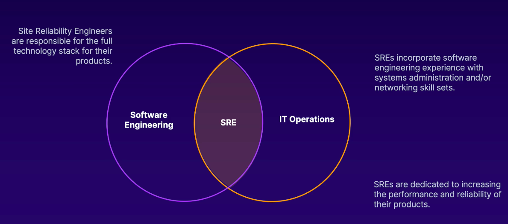

### Invention info 

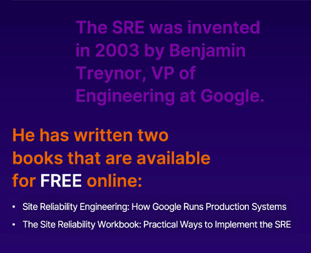

### lets understand traditional roles 

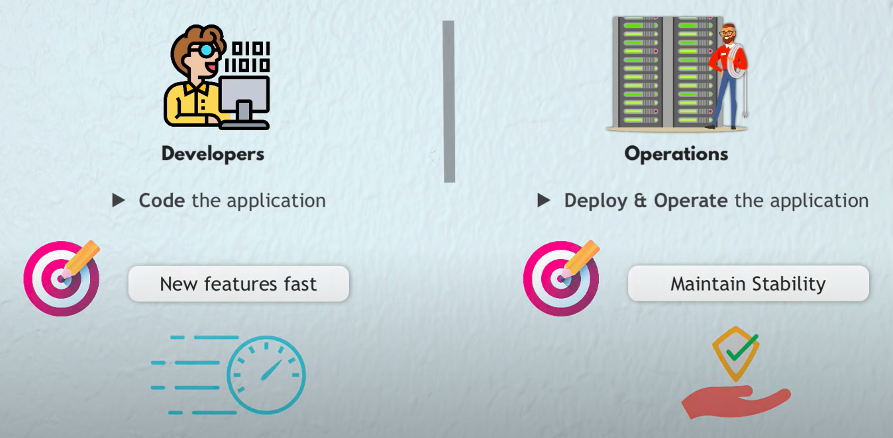

### even after a Devops team is there still we have listed problems 

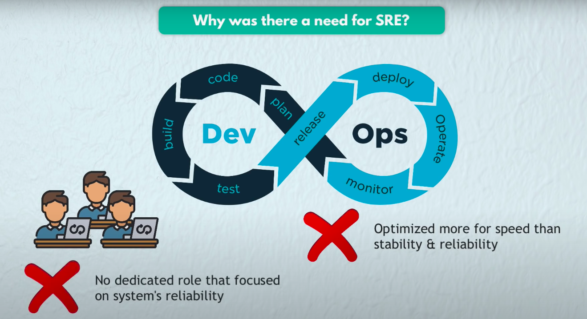

### what is SRE job roles 

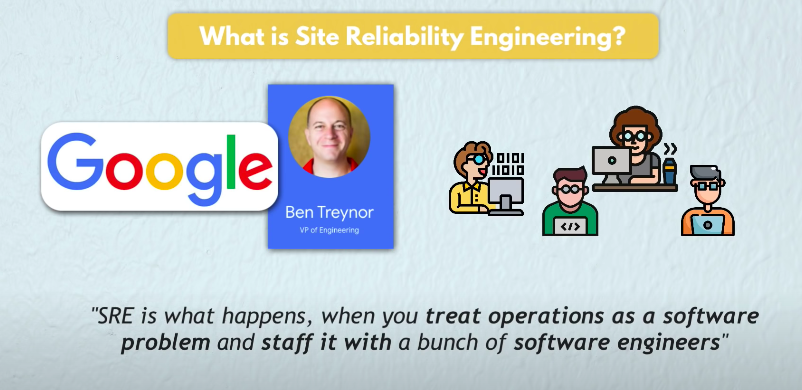

### understanding in one more way 

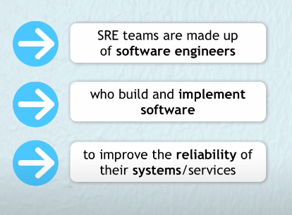

## Lets break it down --- SRE 

### System reliability 

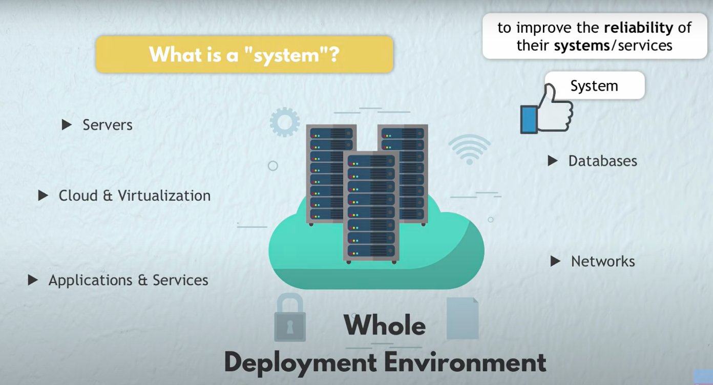

### Reliable vs unreliable 

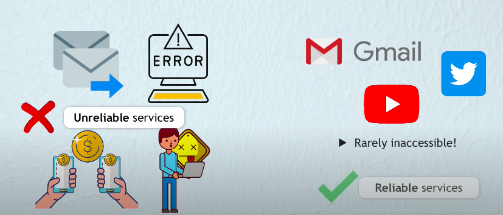

### major problems while app changes 

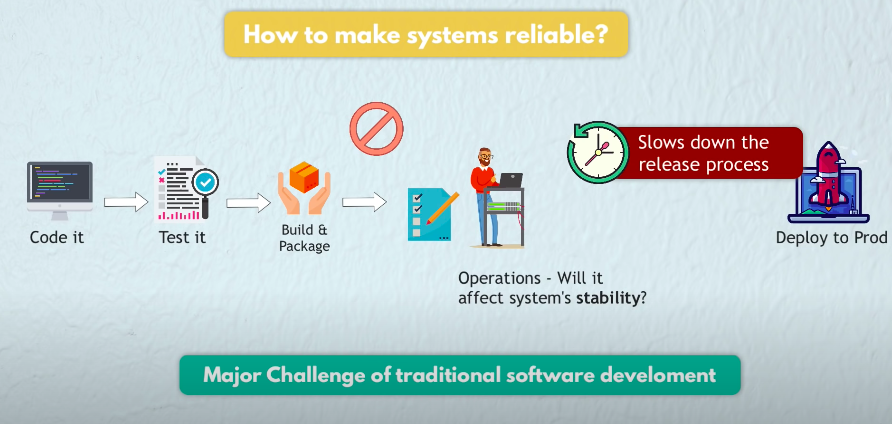

### so the major job of SRE is make automated process for app changes effects in system or evaluation 

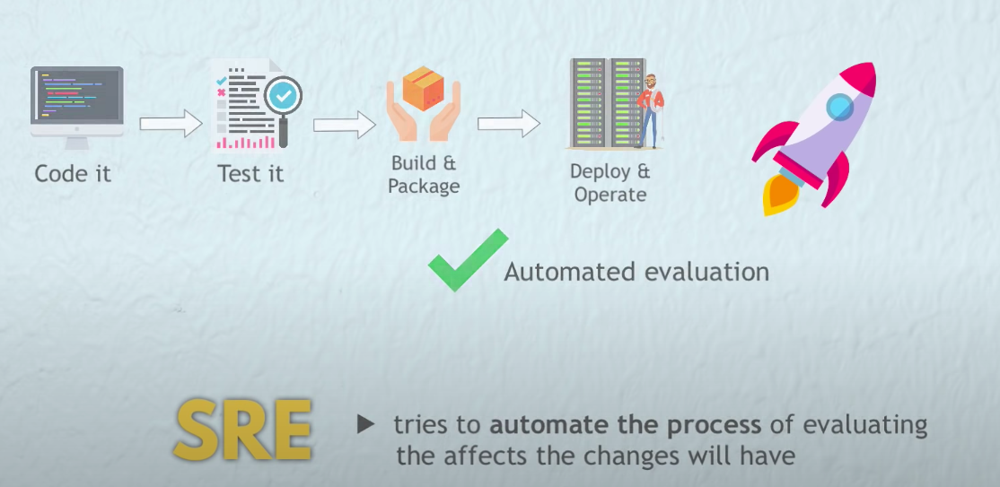

### How automated Evaluation is done -- 

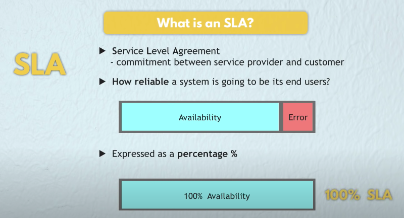

### 100% SLA is almost impossible because end users devices are not even 100 % 

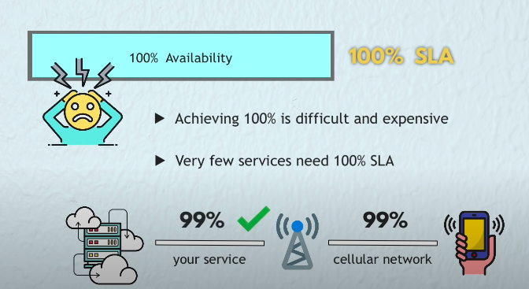

### generally SLA defined in numbers using 9

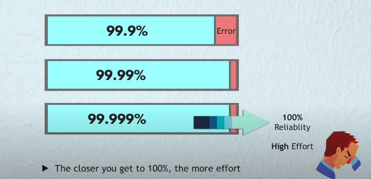

### SLA table 

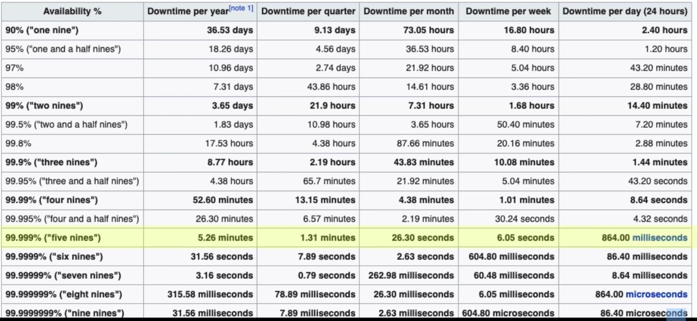

## Note: 

### SLA can be defined 

<ol>
  <li> app accessibility </li>
  <li> app response time </li>
  <li> app error rate </li>
</ol>

### Error SLA example 

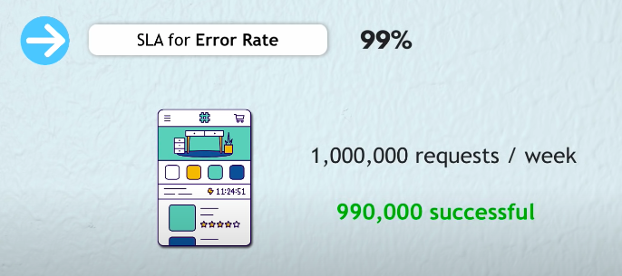

### WHo Define SLA 

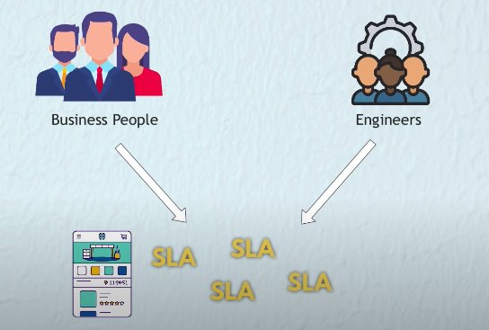

### without loosing business and making customers unhappy -- SRE's are allowed to change some unreliable changes -- know as SLA error budget

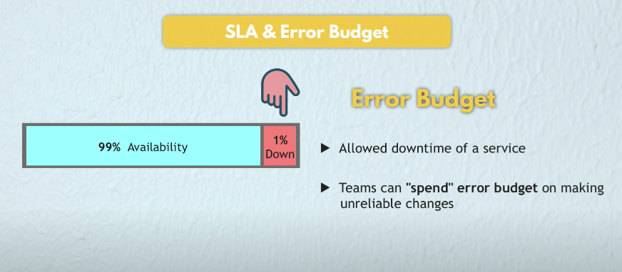

### SLA vs release 

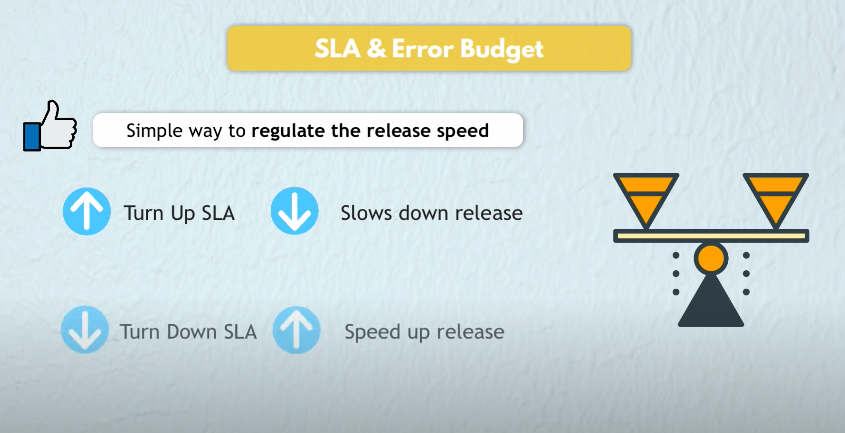

### SO we can say SRE jobs are 

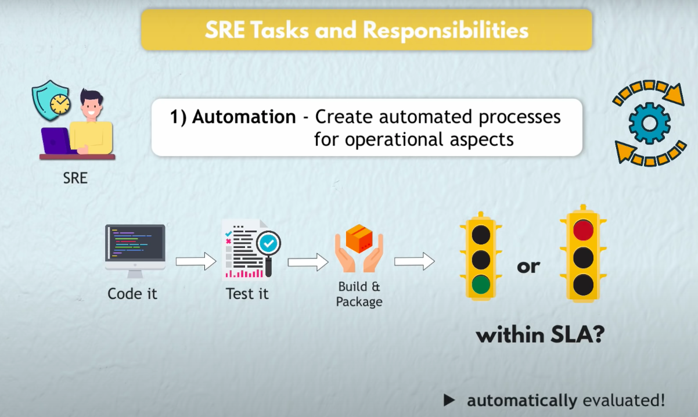

